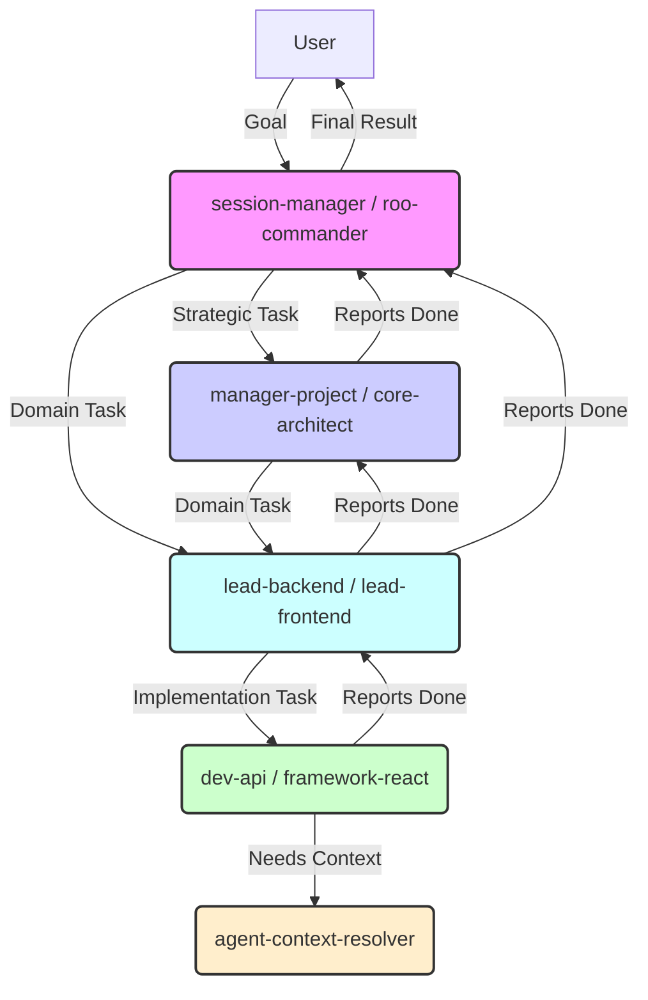

+++
# --- Basic Metadata ---
id = "KB-RC-MODES-ROLES"
title = "Understanding Modes: Roles & Hierarchy"
status = "draft"
doc_version = "1.0" # Version of the role definitions
content_version = 1.0
audience = ["users", "developers", "architects", "contributors", "ai_modes"]
last_reviewed = "2025-04-28" # Use current date
template_schema_doc = ".ruru/templates/toml-md/09_documentation.README.md"
tags = ["roo-commander", "modes", "architecture", "hierarchy", "delegation", "roles", "classification", "core-concept"]
related_docs = [
    "../README.md", # Link to the KB README
    "02_Mode_Selection_Guide.md",
    "03_Mode_Directory_Reference.md",
    "../../01_Introduction/03_Architecture_Overview.md",
    "../../../../.ruru/docs/standards/mode_naming_standard.md" # Contains category list used in slugs
    ]
+++

# Understanding Modes: Roles & Hierarchy

## 1. Introduction / Overview 🎯

Roo Commander operates as a multi-agent system where different AI agents, called **Modes**, collaborate to achieve development goals. To manage this collaboration effectively, modes are assigned specific **Classifications** (roles) and operate within a general **Hierarchy**.

Understanding these roles and the typical flow of delegation helps users interact more effectively and anticipate how tasks will be handled.

## 2. Mode Classifications (Roles) 🏷️

Each mode defined in `.ruru/modes/` has a `classification` field in its TOML frontmatter. This defines its primary role and level within the system. Common classifications include:

*   **👑 Core (`core`):** Foundational system modes essential for the framework's operation or high-level strategy. Often have broad access or unique responsibilities.
    *   *Examples:* `roo-commander` (overall coordination), `core-architect` (technical strategy).
*   **🚦 Director (`director`):** High-level managers responsible for specific strategic areas like project management, product definition, or initial onboarding. They typically receive goals from the User or Commander and delegate to Leads.
    *   *Examples:* `manager-project`, `manager-product`, `manager-onboarding`, `prime-coordinator`.
*   **🧑‍✈️ Lead (`lead`):** Oversee specific technical or functional domains (e.g., frontend, backend, database, QA, security, design, DevOps). They receive tasks from Directors, decompose them, delegate to Workers/Specialists within their domain, review work, and ensure quality/consistency.
    *   *Examples:* `lead-backend`, `lead-frontend`, `lead-db`, `lead-qa`, `lead-security`, `lead-design`, `lead-devops`. Cloud Architects (`cloud-aws`, etc.) also often function at this level.
*   **⭐ Worker / Specialist (`worker`):** The primary implementers. These modes possess deep expertise in a specific technology, framework, tool, or task (e.g., React, Python, API development, testing, database type, IaC tool). They receive specific, actionable tasks from Leads or Coordinators and perform the core implementation work. This is the most numerous category.
    *   *Examples:* `framework-react`, `dev-api`, `infra-specialist`, `test-e2e`, `design-tailwind`, `data-mongo`, `spec-openai`, `auth-clerk`, `cms-wordpress`, `util-senior-dev`.
*   **🤖 Agent / Assistant (`agent` / `assistant`):** Perform specific, often automated or background support tasks, frequently assisting Coordinators or Leads.
    *   *Examples:* `agent-context-resolver` (retrieves info), `agent-research` (gathers external info), `agent-session-summarizer` (creates handovers), `agent-mcp-manager` (handles MCP setup).
*   **🔧 Utility (`utility`):** Provide general-purpose helper functions or cross-cutting capabilities applicable across different domains. Often function like specialized workers.
    *   *Examples:* `util-writer` (documentation), `util-refactor` (code improvement), `util-reviewer` (code review), `dev-git` (Git commands), `dev-fixer` (debugging), `util-typescript`, `util-vite`.

*(Note: The exact classification might evolve, but these represent the main tiers.)*

## 3. Typical Delegation Flow ➡️

While flexible, tasks generally flow down the hierarchy:

1.  **User Goal:** The User provides a high-level goal or task to a coordinating mode (typically `session-manager` or `roo-commander`).
2.  **Coordinator to Director/Lead:** The Coordinator analyzes the goal and delegates strategic planning or domain-specific oversight to the relevant Director (e.g., `manager-project` for task breakdown) or Lead (e.g., `lead-backend` for an API feature).
3.  **Lead to Worker/Specialist:** The Lead breaks down the objective into specific implementation tasks and delegates these to the appropriate Worker/Specialist modes within their domain (e.g., `lead-backend` delegates API endpoint creation to `dev-api` or `framework-fastapi`).
4.  **Worker Execution:** The Worker/Specialist executes the specific task, potentially using tools or basic Agents (`agent-context-resolver`) for support.
5.  **Reporting Back:** Completion status flows back up the chain: Worker reports to Lead, Lead reports to Director/Coordinator, Coordinator reports to User.

**Simplified View:**

**Exceptions & Variations:**

*   **Direct Delegation:** Coordinators might delegate simple, well-defined tasks directly to a Worker/Specialist if no Lead oversight is deemed necessary.
*   **Utility Modes:** Utility modes (`util-*`, `dev-git`, etc.) can often be called by various other modes (Coordinators, Leads, Workers) as needed.
*   **Agents:** Agents are typically invoked by Coordinators or Leads for specific support functions.
*   **`roo-dispatch`:** Acts as a lean coordinator, primarily performing the Lead -> Worker delegation step for routine tasks assigned by `session-manager`.

## 4. Selecting the Right Mode 🎯

When *you* (as a user) or an AI Coordinator needs to delegate, choosing the *most specific and relevant* mode for the task is key.

*   **Refer to the Mode Selection Guide:** Consult `04_Understanding_Modes/02_Mode_Selection_Guide.md` for detailed guidance and hints.
*   **Use the Mode Directory Reference:** Check `04_Understanding_Modes/03_Mode_Directory_Reference.md` (or the generated summary `kb-available-modes-summary.md`) for a list of all available modes and their summaries.
*   **Consider the Hierarchy:** Think about the level of the task. Is it high-level planning (Director/Architect)? Domain coordination (Lead)? Specific implementation (Worker/Specialist)? A support function (Agent)?

## 5. Conclusion ✅

The role-based classification and hierarchical structure of Roo Commander modes enable a powerful system for specialized task delegation and coordination. Understanding these roles and the typical flow helps users and AI agents interact more effectively, ensuring tasks are routed to the appropriate level of expertise for efficient and high-quality execution.