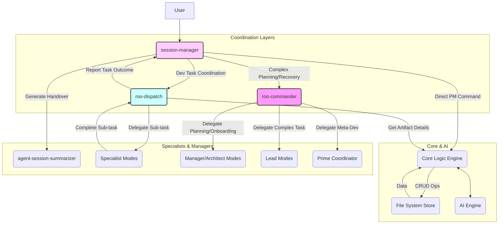

## White Paper: IntelliManage - An AI-Enhanced, Layered Framework for Integrated Project Management

**(v1.2 - Incorporating Session Management & Dispatch Coordination)**

**Abstract:**

Modern software development demands project management solutions that are deeply integrated into the developer's workflow, context-aware, and capable of handling multi-project complexities efficiently. Traditional tools often fall short, creating friction and information silos. This white paper introduces **IntelliManage**, an AI-enhanced project management framework designed for environments like Roo Code. IntelliManage utilizes a standard hierarchical structure (Initiatives, Epics, Features, Tasks, Subtasks) and supports multiple methodologies (Scrum, Kanban, Custom) within a version-controlled, text-based system (`.ruru/projects/`). Crucially, it employs a **layered coordination architecture** featuring a **`session-manager`** for user interaction and context continuity, and a lightweight **`roo-dispatch`** agent for efficient task execution coordination. This approach reserves the comprehensive `roo-commander` for strategic planning and complex scenarios, optimizing daily workflows for speed and reduced overhead while leveraging AI for automation, linking, reporting, and guidance.

**1. Introduction: The Need for Efficient, Integrated, and Intelligent PM**

Software projects are increasingly complex, often involving multiple interconnected components managed within a single workspace (e.g., monorepos). Traditional project management tools, operating outside the IDE, create significant overhead through context switching and manual data synchronization. Furthermore, while powerful AI assistants can automate coding tasks, managing the overall project flow—planning, tracking, linking work items, maintaining context between sessions, and ensuring alignment with goals—remains a challenge, especially considering the token limitations of current Large Language Models (LLMs).

The IntelliManage framework addresses these challenges by proposing a system built on these pillars:

*   **Integration:** Project management artifacts live alongside code and configuration within the `.ruru/` structure.
*   **Structure:** A clear hierarchy (Initiative -> Task) and standardized TOML+MD file formats provide clarity and enable automation.
*   **Flexibility:** Support for multiple projects and methodologies (Scrum, Kanban, Custom) within a single workspace.
*   **Intelligence:** Deep AI integration for automation, insights, and guidance.
*   **Efficiency:** A **layered coordination model** (`session-manager`, `roo-dispatch`, `roo-commander`) optimizes daily interactions for speed and reduced token consumption while preserving powerful capabilities for complex tasks.

This white paper outlines this enhanced vision for IntelliManage.

**2. Core Concepts: The IntelliManage Foundation**

IntelliManage provides a structured way to organize and track work:

*   **Hierarchy:** Initiative -> Epic -> Feature -> Task/Story/Bug -> Subtask (Checklist). Provides traceability from strategy to execution.
*   **File Structure:** All artifacts reside within `.ruru/projects/`, with subdirectories for each project (`[project_slug]`) containing folders like `epics/`, `features/`, `tasks/`, `decisions/`, etc. (See `DOC-FS-SPEC-001`).
*   **TOML+MD Format:** Artifacts use TOML frontmatter for structured metadata (ID, status, type, links, etc.) and Markdown for human-readable descriptions, acceptance criteria, and subtasks. (See `DOC-SCHEMA-001`).
*   **Multi-Project Support:** The `.ruru/projects/[project_slug]/` structure allows managing distinct projects (e.g., frontend, backend) within one workspace.
*   **Core Logic Engine (CLE):** A conceptual component responsible for deterministic operations: reading/writing files, validating schemas, managing links based on TOML fields. (See `DOC-FUNC-SPEC-001`).

**3. Methodology Integration**

IntelliManage adapts to different workflows per project, configured in `.ruru/projects/[project_slug]/project_config.toml`:

*   **Scrum:** Supports sprint definitions, backlog management (Product/Sprint), and AI assistance for estimation, velocity tracking, and burndown charts.
*   **Kanban:** Supports standard or custom workflow states (`status` field), WIP limit monitoring (via AI), and AI assistance for flow visualization (boards, CFDs) and bottleneck analysis.
*   **Custom:** Allows user-defined statuses and workflows, with the AI adapting its reporting and validation.
*   **None:** Provides basic hierarchical tracking without enforcing specific Agile processes.
    (See `DOC-METHODOLOGY-GUIDE-001`).

**4. The Coordination Layers: Optimizing Interaction & Efficiency**

To balance capability with efficiency and user experience, IntelliManage employs a three-tiered coordination approach:

*   **`session-manager` (Primary User Interface):**
    *   **Role:** Handles direct user interaction, manages session context, tracks high-level session goals.
    *   **Functionality:** Starts/resumes sessions (using handover summaries), parses user requests (natural language or `!pm` commands), delegates simple commands to the CLE, delegates development tasks to `roo-dispatch`, requests handover summaries from `agent-session-summarizer`, updates user on progress.
    *   **Benefit:** Provides a continuous, context-aware interaction point for the user, focused on their current work session.

*   **`roo-dispatch` (Lightweight Task Coordinator):**
    *   **Role:** Efficiently coordinates the execution of specific, well-defined development tasks.
    *   **Functionality:** Receives task goals from `session-manager`, reads detailed context from IntelliManage artifacts (via CLE), selects and delegates sub-tasks to operational specialists (e.g., `dev-react`, `dev-api`), monitors completion, aggregates results, reports outcome back to `session-manager`.
    *   **Benefit:** Significantly lower token/context overhead compared to `roo-commander` for routine task execution loops (code -> test -> refine). Stateless regarding the overall user session.

*   **`roo-commander` (Strategic Coordinator / Fallback):**
    *   **Role:** Handles high-level planning, complex scenarios, initial setup, and recovery.
    *   **Functionality:** Reserved for initial project/workspace onboarding, complex multi-feature planning (involving `core-architect`, `manager-product`), workflow troubleshooting, meta-development (managing modes/rules via `prime-coordinator`), and situations where `session-manager` or `roo-dispatch` fail or require higher-level intervention.
    *   **Benefit:** Retains powerful, comprehensive coordination capabilities for tasks demanding broad context and strategic oversight, without burdening everyday interactions.

**5. AI Engine Integration**

The AI Engine remains a crucial cross-cutting component, utilized by all coordination layers and the CLE:

*   **Capabilities:** Artifact generation/enhancement, automated linking, status inference (from Git/chat), reporting/visualization (methodology-aware), guidance/refinement, NLP for user commands. (See `DOC-AI-SPEC-001`).
*   **Interaction:** The active coordinator (`session-manager`, `roo-dispatch`, or `roo-commander`) directs the AI Engine or leverages its outputs via the CLE.

**6. External Integrations (GitHub)**

*   Configurable, per-project, bi-directional synchronization between IntelliManage artifacts and GitHub Issues, Labels, and Milestones.
*   Commit/PR message parsing links development activity back to IntelliManage tasks.
*   Managed by the Integration Layer, interacting with the CLE. (See `DOC-GITHUB-SPEC-001`).

**7. Benefits of IntelliManage with Layered Coordination**

*   **Efficiency:** Reduces token usage and interaction latency for common tasks via `roo-dispatch`.
*   **Session Continuity:** `session-manager` provides seamless pause/resume capabilities.
*   **Focused Roles:** Clear separation of concerns between session management, task execution, and strategic planning.
*   **Optimized UX:** Users interact primarily with the session-focused `session-manager`.
*   **Scalability:** Retains the power of `roo-commander` for complex needs without impacting routine performance.
*   **Full IntelliManage Feature Set:** Incorporates structure, multi-project support, methodology flexibility, AI assistance, and integrations.

**8. Conclusion**

IntelliManage, enhanced with the `session-manager` and `roo-dispatch` coordination layer, represents a significant step forward in creating truly integrated, intelligent, and *efficient* project management within the developer's primary environment. This architecture balances the need for comprehensive coordination capabilities with the practical demands of fast-paced, iterative development and the constraints of current AI models. It provides a robust, flexible, and user-centric framework poised to streamline software development workflows.

---

## Implementation Documentation Plan

To fully specify the implementation of IntelliManage as described above, the following documents should be created:

1.  **`DOC-ARCH-001` - IntelliManage: Overall Architecture & Core Principles:** (Created) High-level system overview, components, and guiding philosophies.
2.  **`DOC-FS-SPEC-001` - IntelliManage: File System Structure Specification:** (Created) Defines the `.ruru/projects/` layout, multi-project structure, subdirectories, and file naming conventions.
3.  **`DOC-SCHEMA-001` - IntelliManage: TOML Schema Definitions:** (Created) Specifies the exact TOML structure for artifact frontmatter and configuration files.
4.  **`DOC-FUNC-SPEC-001` - IntelliManage: Core Functionality Specification (CRUD & Linking):** (Created) Details the creation, reading, updating, deletion, linking, and subtask management logic for artifacts.
5.  **`DOC-METHODOLOGY-GUIDE-001` - IntelliManage: Methodology Implementation Guide:** (Created) Explains how Scrum, Kanban, and Custom methodologies are supported via configuration and status transitions.
6.  **`DOC-AI-SPEC-001` - IntelliManage: AI Integration Specification:** (Created) Details the capabilities, interactions, and responsibilities of the AI Engine component.
7.  **`DOC-GITHUB-SPEC-001` - IntelliManage: GitHub Integration Specification:** (Created) Defines the configuration, mapping, and synchronization logic for GitHub integration.
8.  **`DOC-UI-CMD-SPEC-001` - IntelliManage: User Interaction & Command Specification:** (Created) Specifies the `!pm` command structure and primary user interaction patterns via chat.
9.  **`DOC-SETUP-GUIDE-001` - IntelliManage: Setup & Configuration Guide:** (Created) User guide for initializing and configuring IntelliManage and its projects.
10. **`DOC-USAGE-GUIDE-001` - IntelliManage: Usage Guidelines & Best Practices:** (Created) Tips for users on effectively utilizing the framework.
11. **`MODE-SPEC-SESSION-MANAGER-001` - Mode Specification: `session-manager`:** Defines the `.mode.md` file, including system prompt, capabilities, workflow, limitations, tool access, file access, and metadata for the `session-manager` mode.
12. **`MODE-SPEC-ROO-DISPATCH-001` - Mode Specification: `roo-dispatch`:** Defines the `.mode.md` file, including system prompt, capabilities, workflow, limitations, tool access, file access, and metadata for the `roo-dispatch` mode.
13. **`MODE-SPEC-AGENT-SESSION-SUMMARIZER-001` - Mode Specification: `agent-session-summarizer`:** (If not already sufficiently defined) Defines the mode responsible for creating handover summaries.
14. **`DATA-FORMAT-HANDOVER-001` - Data Format: Handover Summary:** Specifies the structure and content of the handover summary files used by `session-manager` (likely stored in `.ruru/context/handovers/`).
15. **`RULES-SESSION-MANAGER-001` - Rules Specification: `session-manager`:** Defines the operational rules (`.roo/rules-session-manager/`) governing the `session-manager`'s behavior.
16. **`RULES-ROO-DISPATCH-001` - Rules Specification: `roo-dispatch`:** Defines the operational rules (`.roo/rules-roo-dispatch/`) governing the `roo-dispatch`'s behavior.
17. **`KB-OUTLINE-SESSION-MANAGER-001` - KB Outline: `session-manager`:** Outlines the necessary knowledge base content for the `session-manager` mode (`.ruru/modes/session-manager/kb/`).
18. **`KB-OUTLINE-ROO-DISPATCH-001` - KB Outline: `roo-dispatch`:** Outlines the necessary knowledge base content for the `roo-dispatch` mode (`.ruru/modes/roo-dispatch/kb/`).

This list provides a comprehensive plan for documenting the IntelliManage framework with the layered coordination model.