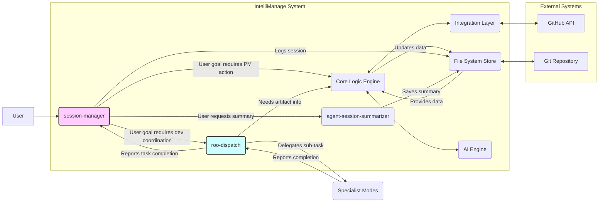

# --- Basic Metadata ---
id = "WP-INTELLIMANAGE-SESSION-DISPATCH-V1"
title = "White Paper: Session Manager & Roo Dispatch - Primary Agents for IntelliManage"
status = "draft"
doc_version = "1.0"
content_version = 1.0
audience = ["developers", "architects", "contributors", "ai_modes", "project_managers"]
last_reviewed = "2025-04-28" # Use current date
template_schema_doc = ".ruru/templates/toml-md/09_documentation.README.md" # Using documentation template
tags = ["intellimanage", "architecture", "proposal", "session-management", "task-coordination", "roo-dispatch", "session-manager", "ai", "workflow", "roo-commander"]
related_docs = [
    "WHITEPAPER-001.md", # Original IntelliManage White Paper
    "DOC-ARCH-001", # IntelliManage Architecture
    "DOC-FS-SPEC-001", # IntelliManage File System Spec
    "DOC-SCHEMA-001", # IntelliManage TOML Schemas
    "DOC-FUNC-SPEC-001", # IntelliManage Core Functionality
    "DOC-AI-SPEC-001", # IntelliManage AI Integration Spec
    "DOC-UI-CMD-SPEC-001" # IntelliManage Command Spec
    ]
+++

# White Paper: Session Manager & Roo Dispatch - Primary Agents for IntelliManage

## 1. Abstract

This white paper proposes a refined interaction model for the IntelliManage project management framework, introducing two new coordinating modes: **`session-manager`** and **`roo-dispatch`**. This architecture aims to enhance the user experience for day-to-day development tasks by providing efficient session continuity (`session-manager`) and lightweight task coordination (`roo-dispatch`), while reserving the comprehensive (but potentially token-heavy) `roo-commander` for complex planning, onboarding, and recovery scenarios. This layered approach integrates seamlessly with IntelliManage's file-based artifact system (`.ruru/projects/`) and AI capabilities, offering a more balanced and efficient workflow within AI-driven development environments like Roo Code.

## 2. Introduction: Optimizing Daily Interaction

The IntelliManage framework (`DOC-ARCH-001`, `WHITEPAPER-001`) establishes a powerful, integrated system for managing projects within the development environment using structured TOML+MD artifacts. While the `roo-commander` mode provides robust high-level coordination, its comprehensive nature can lead to significant token usage and conversational overhead, potentially hindering the flow of rapid, iterative development tasks.

Furthermore, maintaining context between distinct work sessions or across workspace reloads is crucial for productivity. Users need a way to seamlessly pause and resume their work, picking up where they left off without extensive manual context reconstruction.

This proposal addresses these needs by introducing a two-tiered coordination system built upon the IntelliManage foundation:
*   A `session-manager` mode focused on user interaction and maintaining session state.
*   A `roo-dispatch` mode focused on efficient, low-overhead execution of specific delegated tasks requiring specialist coordination.

## 3. Proposed Architecture: Layered Coordination

We propose introducing two new modes to act as the primary interfaces for IntelliManage operations:

1.  **`session-manager`**: The top-level mode responsible for managing the user's work session context and high-level goals.
2.  **`roo-dispatch`**: A streamlined coordinator responsible for executing specific, well-defined tasks by delegating to operational specialist modes.

This creates the following primary interaction flow:

## 4. Mode Detail: `session-manager`

*   **Focus:** User interaction, session state management, high-level goal tracking.
*   **Responsibilities:**
    *   Act as the primary user interface for IntelliManage workflows.
    *   Handle session start/resume by loading the latest handover summary (`.ruru/context/handovers/`).
    *   Work with the user to establish and track the main goal(s) for the current work session.
    *   Maintain a session log (e.g., `.ruru/sessions/SESSION-....md`) documenting high-level progress, key decisions, and major task outcomes.
    *   Parse user requests (potentially leveraging the AI Engine).
    *   Delegate specific, actionable tasks:
        *   To the **Core Logic Engine (CLE)** for direct `!pm` command execution (e.g., `!pm list tasks`).
        *   To **`roo-dispatch`** for development/refactoring/testing tasks requiring specialist coordination.
        *   To **`agent-session-summarizer`** for generating handover summaries upon request or session end.
    *   Receive completion reports from `roo-dispatch` or results from the CLE.
    *   Update the user on progress and prompt for next steps within the session context.
*   **Characteristics:** More conversational, stateful regarding the overall session, delegates detailed execution logic.

## 5. Mode Detail: `roo-dispatch`

*   **Focus:** Efficient execution coordination for specific, delegated development tasks.
*   **Responsibilities:**
    *   Receive a well-defined task goal and context from `session-manager` (or potentially directly from the user in specific scenarios).
    *   Interact with the CLE to read necessary IntelliManage artifacts (tasks, features, epics) for detailed context.
    *   Identify and select the appropriate operational specialist mode(s) required for the task steps (using Stack Profile, tags, etc.).
    *   Delegate sub-tasks to specialists using `new_task`, providing clear instructions and context.
    *   Monitor specialist task completion via `attempt_completion`.
    *   Report the overall task outcome (success, failure, specific blockers reported by specialists) back to the `session-manager`.
*   **Characteristics:** Lean system prompt/ruleset, minimal conversational overhead, focused purely on task execution routing and management. Significantly lower token usage compared to `roo-commander`. Stateless regarding the overall user session.

## 6. Integration with IntelliManage Artifacts

This architecture fully utilizes the IntelliManage file system structure and schemas:

*   **`session-manager`:**
    *   Reads handover summaries from `.ruru/context/handovers/`.
    *   Writes session logs to `.ruru/sessions/`.
    *   Triggers CLE operations which read/write artifacts in `.ruru/projects/[project_slug]/`.
*   **`roo-dispatch`:**
    *   Triggers CLE operations to read artifacts from `.ruru/projects/[project_slug]/` (e.g., reading the details of a `TASK-ID.md` file it was asked to implement).
    *   Delegates to specialists who will read/write relevant source code files (`src/`) or test files (`tests/`), and potentially update their assigned MDTM task files (`.ruru/projects/[project_slug]/tasks/TASK-....md`).

## 7. The Revised Role of `roo-commander`

With `session-manager` and `roo-dispatch` handling the primary interaction and routine task coordination, the full `roo-commander` mode becomes reserved for higher-level, less frequent, or more complex scenarios:

*   **Initial Workspace/Project Onboarding:** Handling the very first setup before project structures and session context exist.
*   **Complex Strategic Planning:** When a user goal requires significant breakdown into Epics and Features, potentially involving `core-architect` and `manager-product`.
*   **Workflow Troubleshooting:** Diagnosing issues within the coordination process itself.
*   **Recovery:** Handling situations where `session-manager` or `roo-dispatch` encounter unrecoverable errors or ambiguity.

This preserves `roo-commander`'s power for situations demanding its comprehensive capabilities and larger context window, while optimizing daily interactions for speed and efficiency.

## 8. Benefits

*   **Improved Efficiency:** `roo-dispatch` offers a lower-token, faster coordination path for common development tasks.
*   **Enhanced Session Continuity:** `session-manager` provides seamless context resumption between work periods.
*   **Clear Separation of Concerns:** Session management (`session-manager`) is distinct from task execution coordination (`roo-dispatch`) and high-level planning (`roo-commander`).
*   **Better User Experience:** Users interact with a mode (`session-manager`) focused on their current session goal, with efficient background coordination.
*   **Scalability:** Modular design allows independent improvement of session management and task execution logic.
*   **Alignment with IntelliManage:** Integrates naturally with the file-based, multi-project structure and AI capabilities defined in the IntelliManage specifications.

## 9. Challenges & Considerations

*   **Delegation Overhead:** Introduces an extra layer (`session-manager` -> `roo-dispatch`) which could add minor latency for simple coordinated tasks.
*   **Context Passing:** Requires careful design to ensure `session-manager` passes sufficient and relevant context to `roo-dispatch` for each task.
*   **Mode Discovery/Default:** Requires defining `session-manager` as the likely default interaction mode for IntelliManage workflows.

## 10. Conclusion & Next Steps

The proposed `session-manager` and `roo-dispatch` architecture offers a compelling evolution for interacting with the IntelliManage framework. It addresses the need for efficient session management and reduces the overhead associated with using the full `roo-commander` for routine tasks. This layered approach enhances usability and performance while maintaining robust coordination capabilities.

**Next Steps:**

1.  Define the detailed `.mode.md`, rules (`.roo/rules-*/`), and KB (`.ruru/modes/*/kb/`) files for `session-manager` and `roo-dispatch`.
2.  Refine the interaction logic and context passing mechanisms between `session-manager`, `roo-dispatch`, and the CLE/AI Engine.
3.  Implement and test the session start/resume and handover summary features.
4.  Update user documentation (`DOC-USAGE-GUIDE-001`) to reflect the new primary interaction flow via `session-manager`.