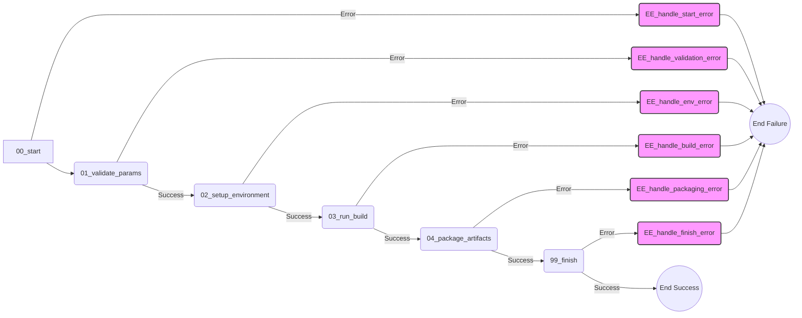

+++
# --- Workflow Metadata ---
id = "WF-CREATE-ROO-CMD-BUILD-V1" # (String, Required) Unique identifier
title = "Workflow: Create Roo Commander Build" # (String, Required)
description = """
(String, Required) Defines the steps required to create a new build for Roo Commander.
This workflow orchestrates the necessary actions to compile, package, and prepare a distributable version.
"""
version = "1.0.0" # (String, Required) Semantic version for the workflow definition.
status = "Draft" # (String, Required) Current status: "Draft", "Active", "Deprecated", "Experimental".
tags = ["workflow", "build", "roo-commander", "release"] # (Array of Strings, Optional) Keywords for search/categorization.

# --- Execution Control ---
entry_point = "00_start.md" # (String, Required) Filename of the first step to execute.

# --- Interface ---
inputs = [ # (Array of Strings, Optional) Describe overall inputs needed to start the workflow.
    "build_parameters: Object containing details like version, platform, flags.", # Made more specific
]
outputs = [ # (Array of Strings, Optional) Describe the expected final artifacts or outcomes.
    "build_status: String indicating 'Success' or 'Failure'.", # Made more specific
    "packaged_artifact_path: String path to the final artifact.", # Made more specific
    "log_paths: Array of strings containing paths to relevant logs (build, packaging).", # Made more specific
]

# --- Housekeeping ---
owner = "lead-devops" # (String, Optional) Added owner field
maintainer = "lead-devops" # (String, Optional) Added maintainer field
last_updated = "{{DATE}}" # (String, Required) Date of last modification. Use placeholder.
template_schema_doc = ".ruru/templates/toml-md/23_workflow_readme.md" # (String, Required) Link to this template definition.
related_docs = [] # (Array of Strings, Optional) Links to related rules, KBs, ADRs. # Consider adding links later
+++

# Workflow: Create Roo Commander Build

## Overview

Defines the steps required to create a new build for Roo Commander.
## Workflow Diagram

---
This workflow orchestrates the necessary actions to compile, package, and prepare a distributable version.

## Usage

This workflow is typically initiated by a coordinator or release manager when a new build of Roo Commander is required. Provide the necessary build parameters as input.

## Inputs

*   **Build Parameters:** Details specifying the desired build, such as target version number, target platform(s), and any specific build flags or configurations.

## Outputs

*   **Build Status:** Confirmation indicating whether the build process completed successfully or encountered errors.
*   **Artifacts/Logs:** Path(s) to the generated build artifacts (e.g., executables, archives) or detailed logs if the build failed.