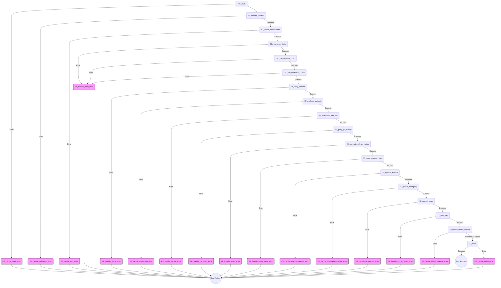

+++
# --- Workflow Metadata ---
id = "WF-CREATE-ROO-CMD-BUILD-V1" # (String, Required) Unique identifier
title = "Workflow: Create Roo Commander Build" # (String, Required)
description = """
(String, Required) Defines the full process for creating a Roo Commander build,
including running build scripts, verifying artifacts, packaging, generating release notes,
updating documentation (README, CHANGELOG), committing changes, tagging the release,
and optionally creating a GitHub release.
"""
version = "1.0.0" # (String, Required) Semantic version for the workflow definition.
status = "Draft" # (String, Required) Current status: "Draft", "Active", "Deprecated", "Experimental".
tags = ["workflow", "build", "roo-commander", "release", "documentation", "git", "github"] # (Array of Strings, Optional) Keywords for search/categorization.

# --- Execution Control ---
entry_point = "00_start.md" # (String, Required) Filename of the first step to execute.

# --- Interface ---
inputs = [ # (Array of Strings, Optional) Describe overall inputs needed to start the workflow.
    "build_parameters: Object containing details like version, platform, flags, create_github_release (boolean).",
]
outputs = [ # (Array of Strings, Optional) Describe the expected final artifacts or outcomes.
    "workflow_result: Summary object containing overall status and paths/URLs to artifacts, logs, release notes, commit, and GitHub release.",
]

# --- Housekeeping ---
owner = "lead-devops" # (String, Optional) Added owner field
maintainer = "lead-devops" # (String, Optional) Added maintainer field
last_updated = "{{DATE}}" # (String, Required) Date of last modification. Use placeholder.
template_schema_doc = ".ruru/templates/toml-md/23_workflow_readme.md" # (String, Required) Link to this template definition.
related_docs = [] # (Array of Strings, Optional) Links to related rules, KBs, ADRs. # Consider adding links later
+++

# Workflow: Create Roo Commander Build

## Overview

Defines the full process for creating a Roo Commander build, including running build scripts,
verifying artifacts, packaging, generating release notes, updating documentation (README, CHANGELOG),
committing changes, tagging the release, and optionally creating a GitHub release.

## Workflow Diagram

---
This workflow orchestrates the necessary actions to compile, package, document, tag, and optionally release a new version of Roo Commander.

## Usage

This workflow is typically initiated by a coordinator or release manager when a new build of Roo Commander is required. Provide the necessary build parameters as input.

## Inputs

*   **Build Parameters:** An object containing:
    *   `version`: The semantic version string for the build (e.g., "v1.2.3").
    *   `platform`: Target platform (optional, defaults might apply).
    *   `build_flags`: Any specific flags for the build scripts (optional).
    *   `create_github_release`: Boolean flag (default `false`) indicating whether to create a GitHub release.

## Outputs

*   **Workflow Result:** A summary object containing:
    *   `overall_status`: 'Success' or 'Failure'.
    *   Status flags for individual critical steps (build, verify, package, commit, tag push).
    *   `github_release_status`: 'Success', 'Failure', or 'Skipped'.
    *   `artifact_path`: Path to the final packaged build artifact.
    *   `release_notes_path`: Path to the generated release notes file.
    *   `commit_hash`: SHA hash of the documentation commit.
    *   `github_release_url`: URL of the GitHub release (if created).