# Mode Manifest & Organizational Chart

**Version:** 1.0
**Date:** 2025-04-13
**Status:** Active

## 1. Introduction

To enhance the usability and understanding of the Roo Commander multi-agent system, particularly for new users or complex projects, this document provides a "Mode Manifest" or "Organizational Chart".

**Goal:** Provide a clear, accessible overview of the available modes (the "team"), their roles, capabilities, reporting structure (hierarchy), and key interaction patterns within the current project workspace.

## 2. Concept

The core idea is to maintain a document that serves as a central directory for the active modes in the workspace. This document is:

*   **Human-Readable:** Easily understood by the user.
*   **AI-Consumable:** Used by `roo-commander` or `context-resolver` to understand available resources.
*   **Workspace-Specific:** Reflects the modes actually loaded or defined for the current project.

## 3. Team Structure (Hierarchy v7)

*   **00x-executive:** Overall Coordination
    *   `roo-commander`: 👑 Roo Commander
*   **01x-director:** Planning & Architecture
    *   `technical-architect`: 🏗️ Technical Architect
    *   `project-manager`: 📋 Project Manager
    *   `project-onboarding`: 🚀 Project Onboarding
    *   `product-manager`: 📊 Product Manager
*   **02x-lead:** Department Coordination
    *   **design:**
        *   `design-lead`: 🎨 Design Lead
    *   **frontend:**
        *   `frontend-lead`: 🖥️ Frontend Lead
    *   **backend:**
        *   `backend-lead`: ⚙️ Backend Lead
    *   **database:**
        *   `database-lead`: 💾 Database Lead
    *   **qa:**
        *   `qa-lead`: 🧪 QA Lead
    *   **devops:**
        *   `devops-lead`: 🚀 DevOps Lead
        *   `aws-architect`: ☁️ AWS Architect
        *   `azure-architect`: ☁️ Azure Architect
        *   `gcp-architect`: ☁️ GCP Architect
    *   **security:**
        *   `security-lead`: 🛡️ Security Lead
*   **03x-worker:** Task Execution
    *   **030-design:**
        *   `diagramer`: 📊 Diagramer
        *   `one-shot-web-designer`: ✨ One Shot Web Designer
        *   `ui-designer`: 🎨 UI Designer
    *   **031-frontend:**
        *   `accessibility-specialist`: ♿ Accessibility Specialist
        *   `angular-developer`: 🅰️ Angular Developer
        *   `animejs-specialist`: 🎬 AnimeJS Specialist
        *   `ant-design-specialist`: 🐜 Ant Design Specialist
        *   `astro-developer`: 🚀 Astro Developer
        *   `bootstrap-specialist`: 🅱️ Bootstrap Specialist
        *   `clerk-auth-specialist`: 🔐 Clerk Auth Specialist
        *   `d3js-specialist`: 📈 D3.js Specialist
        *   `frontend-developer`: 🖥️ Frontend Developer
        *   `jquery-specialist`: 🔍 jQuery Specialist
        *   `material-ui-specialist`: 🎭 Material UI Specialist
        *   `nextjs-developer`: ⏭️ Next.js Developer
        *   `react-specialist`: ⚛️ React Specialist
        *   `remix-developer`: 🎵 Remix Developer
        *   `shadcn-ui-specialist`: 🎭 ShadCN UI Specialist
        *   `sveltekit-developer`: 🔥 SvelteKit Developer
        *   `tailwind-specialist`: 💨 Tailwind CSS Specialist
        *   `threejs-specialist`: 🎮 Three.js Specialist
        *   `typescript-specialist`: 📘 TypeScript Specialist
        *   `vite-specialist`: ⚡ Vite Specialist
        *   `vuejs-developer`: 💚 Vue.js Developer
    *   **032-backend:**
        *   `api-developer`: 🔌 API Developer
        *   `directus-specialist`: 🔄 Directus Specialist
        *   `django-developer`: 🐍 Django Developer
        *   `fastapi-developer`: 🚀 FastAPI Developer
        *   `firebase-developer`: 🔥 Firebase Developer
        *   `flask-developer`: 🧪 Flask Developer
        *   `frappe-specialist`: 🧩 Frappe Specialist
        *   `php-laravel-developer`: 🐘 PHP Laravel Developer
        *   `supabase-developer`: ⚡ Supabase Developer
        *   `wordpress-specialist`: 📰 WordPress Specialist
    *   **033-database:**
        *   `database-specialist`: 💾 Database Specialist
        *   `dbt-specialist`: 🔄 DBT Specialist
        *   `elasticsearch-specialist`: 🔍 Elasticsearch Specialist
        *   `mongodb-specialist`: 🍃 MongoDB Specialist
        *   `mysql-specialist`: 🐬 MySQL Specialist
        *   `neon-db-specialist`: 🌟 Neon DB Specialist
    *   **034-qa:**
        *   `e2e-tester`: 🧪 E2E Tester
        *   `integration-tester`: 🔗 Integration Tester
    *   **035-devops:**
        *   `cicd-specialist`: 🔄 CI/CD Specialist
        *   `cloudflare-workers-specialist`: ☁️ Cloudflare Workers Specialist
        *   `docker-compose-specialist`: 🐳 Docker Compose Specialist
        *   `infrastructure-specialist`: 🏗️ Infrastructure Specialist
    *   **036-auth:**
        *   `supabase-auth-specialist`: 🔑 Supabase Auth Specialist
        *   `firebase-auth-specialist`: 🔥 Firebase Auth Specialist
    *   **037-ai-ml:**
        *   `openai-specialist`: 🧠 OpenAI Specialist
        *   `huggingface-specialist`: 🤗 Hugging Face Specialist
    *   **039-cross-functional:**
        *   `bug-fixer`: 🐛 Bug Fixer
        *   `code-reviewer`: 👁️ Code Reviewer
        *   `complex-problem-solver`: 🧩 Complex Problem Solver
        *   `eslint-specialist`: 🧹 ESLint Specialist
        *   `git-manager`: 🔧 Git Manager
        *   `junior-developer`: 🌱 Junior Developer
        *   `mode-maintainer`: 🛠️ Mode Maintainer
        *   `performance-optimizer`: ⚡ Performance Optimizer
        *   `refactor-specialist`: 🔄 Refactor Specialist
        *   `second-opinion`: 🤔 Second Opinion
        *   `security-specialist`: 🛡️ Security Specialist
        *   `senior-developer`: 🧙 Senior Developer
        *   `technical-writer`: ✍️ Technical Writer
*   **04x-assistant:** Support Functions
    *   `context-condenser`: 📝 Context Condenser
    *   `context-resolver`: 📖 Context Resolver
    *   `crawl4ai-specialist`: 🕸️ Crawl4AI Specialist
    *   `discovery-agent`: 🔍 Discovery Agent
    *   `file-repair-specialist`: 🔧 File Repair Specialist
    *   `firecrawl-specialist`: 🔥 Firecrawl Specialist
    *   `research-context-builder`: 📚 Research Context Builder
*   **05x-footgun:** Expert Overrides (Use with Caution!)
    *   `footgun-code`: ⚡️ Footgun Code
    *   `footgun-architect`: 🏗️ Footgun Architect
    *   `footgun-debug`: 🔬 Footgun Debug
    *   `footgun-ask`: 🗣️ Footgun Ask

## 4. Organizational Chart (Mermaid)

```mermaid
graph TD
    CMD(👑 Roo Commander) --> D_TA(🏗️ Dir: Tech Architect)
    CMD --> D_PM(📋 Dir: Project Manager)
    CMD --> D_PO(🚀 Dir: Project Onboarding)
    CMD --> D_PDM(📊 Dir: Product Manager)

    D_TA --> L_FE(🖥️ Lead: Frontend)
    D_TA --> L_BE(⚙️ Lead: Backend)
    D_TA --> L_DB(💾 Lead: Database)
    D_TA --> L_DO(🚀 Lead: DevOps)
    D_TA --> L_SEC(🛡️ Lead: Security)
    D_PM --> L_FE
    D_PM --> L_BE
    D_PM --> L_DB
    D_PM --> L_DO
    D_PM --> L_QA(🧪 Lead: QA)
    D_PM --> L_DES(🎨 Lead: Design)
    D_PM --> L_SEC

    L_DO --> A_AWS(☁️ Lead: AWS Arch)
    L_DO --> A_AZURE(☁️ Lead: Azure Arch)
    L_DO --> A_GCP(☁️ Lead: GCP Arch)

    L_DES --> W_DES[030-design Workers]
    L_FE --> W_FE[031-frontend Workers]
    L_BE --> W_BE[032-backend Workers]
    L_DB --> W_DB[033-database Workers]
    L_QA --> W_QA[034-qa Workers]
    L_DO --> W_DO[035-devops Workers]
    L_SEC --> W_AUTH[036-auth Workers]
    L_SEC --> W_AIML[037-ai-ml Workers]

    subgraph Cross-Functional Workers
        W_XF[039-cross-functional Workers]
    end

    subgraph Assistants
        ASST[04x-assistant Workers]
    end

    subgraph Footgun Modes
        FG[05x-footgun Modes]
    end

    CMD --> W_XF
    CMD --> ASST
    CMD --> FG
```

## 5. Implementation Considerations

*   **Location:** This manifest resides in `v7.0/future-planning/mode-manifest-org-chart.md` during development, and will be moved to a more permanent location when finalized.
*   **Generation:** This document is manually maintained based on the modes in the `v7.0/modes/` directory.
*   **Updating:** This document should be updated whenever modes are added, removed, or modified.
*   **AI Consumption:** The structure is designed to be predictable and easily parsable for AI use.

## 6. Benefits

*   Improves user understanding of the system's capabilities and structure.
*   Provides a quick reference for available modes and their roles.
*   Aids AI modes (like Commander) in selecting appropriate delegates.
*   Formalizes the "team" concept.

## 7. Next Steps

*   Finalize the permanent location for this manifest.
*   Consider automating the generation/maintenance of this document.
*   Integrate references to this manifest into the `roo-commander`'s initial greeting or help responses.
*   Ensure all mode descriptions are accurate and consistent.