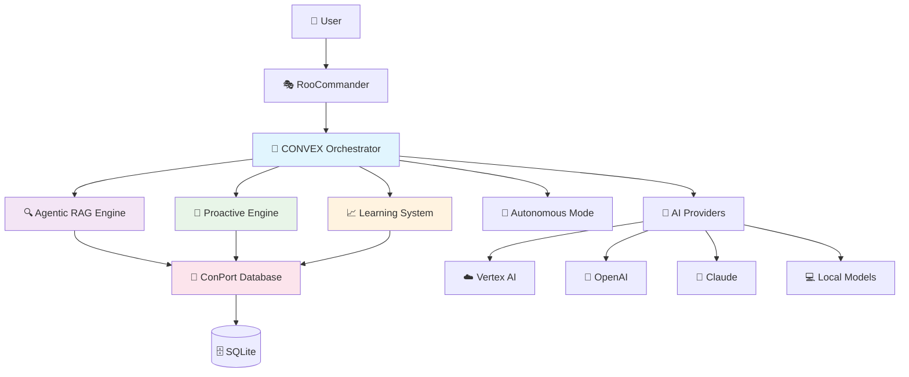

# 🚀 ROOPORT - The Ultimate Agentic Coding Tool

[](https://opensource.org/licenses/MIT)
[](https://www.python.org/downloads/)
[](https://github.com/psf/black)

**ROOPORT** transforms your development workflow with advanced AI capabilities, building upon the RooCode ecosystem to create the most intelligent coding assistant ever built.

## 🎯 What Makes ROOPORT Special
 
### 🧠 **CONVEX Orchestration (Dual-Brain Intelligence)**
- **Intelligent Query Routing**: Dynamically routes queries to the best information source – ConPort for deep project-specific context or Vertex AI for broad external knowledge.
- **Unified Decision Making**: Leverages the "dual-brain" approach, combining ConPort's persistent project memory with Vertex AI's research capabilities.
- **Contextual Understanding**: CONVEX (the Ultimate Agentic Orchestrator) analyzes query intent to determine the optimal processing path.
 
### 🧠 **Agentic RAG Engine**
- **Iterative Query Refinement**: Automatically improves search queries based on initial results
- **Multi-Strategy Retrieval**: Combines keyword search, semantic search, and graph traversal (primarily via ConPort)
- **Context Synthesis**: Intelligently combines information from multiple sources (ConPort, Vertex AI)
- **Confidence Scoring**: Provides transparency about information reliability
 
### 🎯 **Proactive Orchestration Engine**
- **Intelligent Project Analysis**: Continuously analyzes your codebase and development patterns (leveraging ConPort)
- **Opportunity Identification**: Suggests optimizations, refactoring, and improvements
- **Workflow Enhancement**: Recommends process improvements based on your working style
- **Predictive Assistance**: Anticipates your needs before you ask
 
### 📈 **Continuous Learning System**
- **Feedback Integration**: Learns from your preferences and corrections (feedback stored in ConPort)
- **Performance Optimization**: Self-improves based on usage patterns
- **Personalized Responses**: Adapts communication style to your preferences
- **Quality Metrics**: Tracks and improves response accuracy over time
 
### 🤖 **Configurable Autonomous Operation**
- **User-Controlled Automation**: Choose your comfort level (OFF/MINIMAL/STANDARD/FULL)
- **Intelligent Decision Making**: High-confidence actions execute automatically
- **Safety Mechanisms**: Built-in protections for destructive operations
- **Transparent Operation**: Clear indication of autonomous vs. manual actions
 
### 🔗 **Dynamic Knowledge Graph Building (via ConPort)**
- **Relationship Discovery**: Automatically identifies connections between project elements within ConPort.
- **Context Preservation**: Maintains project memory across sessions in ConPort.
- **Decision Tracking**: Records and links architectural decisions in ConPort.
- **Pattern Recognition**: Learns project-specific patterns and conventions stored in ConPort.
 
## 🚀 Quick Start

```bash
# 1. Clone and install ROOPORT
git clone https://github.com/tgf-between-your-legs/rooport.git
cd rooport
pip install -e .

# 2. Set up environment variables
cp .env.template .env
# Edit .env with your API keys

# 3. Configure MCP servers
cp config/mcp.template.json .roo/mcp.json
# Edit with your actual paths

# 4. Test installation
python -c "import rooport; print('ROOPORT ready to go! 🚀')"

# 5. Run your first query
rooport --query "Analyze my project and suggest improvements"
```

## 📚 Complete Documentation Suite

### 🎓 **Getting Started**
- **[Advanced Usage Guide](docs/advanced-usage-guide.md)** - Complete installation with ConPort, Vertex AI, and RooCommander integration
- **[RooCode Integration Guide](docs/roocode-integration-guide.md)** - Deep dive into RooCode ecosystem integration
- **[Testing & Validation Guide](docs/testing-validation-guide.md)** - 5-level testing framework with real-world validation

### 🔧 **Technical Documentation**
- **[API Reference](docs/api-reference.md)** - Complete API documentation with examples
- **[Configuration Guide](docs/configuration.md)** - Detailed configuration options and best practices
- **[Architecture Overview](docs/architecture.md)** - System design and component interactions

### 🆘 **Support & Troubleshooting**
- **[Troubleshooting & FAQ](docs/troubleshooting-faq.md)** - Common issues, solutions, and frequently asked questions
- **[Performance Optimization](docs/performance.md)** - Tips for optimal performance and resource usage
- **[Security Guide](docs/security.md)** - Security best practices and privacy considerations

## 🏗️ Architecture Overview

ROOPORT's architecture is centered around **CONVEX (the Ultimate Agentic Orchestrator - UO)**, which intelligently manages a "dual-brain" system. It routes queries and tasks to:
- **ConPort (CP)**: For deep, persistent project-specific knowledge, history, and context.
- **AI Providers (Vertex AI, etc.)**: For general knowledge, research, and advanced generative capabilities.



## 🌟 Key Features in Detail

### Real-Time Intelligence
- **Context-Aware Responses**: Understands your project structure, history, and patterns
- **Adaptive Learning**: Improves suggestions based on your feedback and preferences
- **Intelligent Caching**: Optimizes performance with smart prompt caching strategies
- **Cross-Session Memory**: Maintains context across development sessions

### Professional Integration
- **RooCommander Native**: Seamlessly integrates with existing RooCommander workflows
- **VS Code Extension**: Works naturally within your development environment
- **Multiple AI Providers**: Support for Vertex AI, OpenAI, Claude, and local models
- **Enterprise Ready**: Configurable privacy, security, and deployment options

### Advanced Capabilities
- **Multi-Modal Understanding**: Processes code, documentation, and natural language
- **Predictive Analysis**: Anticipates potential issues and suggests preventive measures
- **Workflow Optimization**: Learns and improves your development processes
- **Knowledge Synthesis**: Combines information from multiple sources intelligently

## 🎯 Real-World Value Propositions

### For Individual Developers
- **10x Productivity**: Intelligent code generation, debugging, and optimization
- **Continuous Learning**: AI that adapts to your coding style and preferences
- **Context Preservation**: Never lose project context between sessions
- **Proactive Assistance**: Get suggestions before you realize you need them

### For Development Teams
- **Shared Knowledge**: Team-wide knowledge base with automatic updates
- **Consistent Patterns**: Enforce architectural decisions and coding standards
- **Onboarding Acceleration**: New team members get instant project context
- **Decision Tracking**: Complete audit trail of technical decisions

### For Enterprise
- **Scalable Intelligence**: Supports multiple projects and teams
- **Security First**: Local-first architecture with configurable privacy
- **Integration Ready**: Works with existing tools and workflows
- **Measurable ROI**: Track productivity improvements and code quality metrics

## 🧪 What's Currently Operational vs. Theoretical

### ✅ **Fully Operational**
- Ultimate Agentic Orchestrator with parallel engine execution
- Configurable autonomous operation (OFF/MINIMAL/STANDARD/FULL)
- ConPort integration for persistent memory
- Multi-provider AI integration (Vertex AI, OpenAI, Claude)
- Professional Python package structure with CLI
- Complete security sanitization and environment variable configuration

### 🔄 **Operational with Data**
- Agentic RAG Engine (operational when ConPort has project data)
- Proactive Orchestration Engine (improves with project history)
- Continuous Learning System (effective after feedback collection)
- Knowledge graph building (grows with usage)

### 🎯 **Theoretical/Future**
- Advanced semantic search (requires vector database integration)
- Predictive debugging (needs machine learning model training)
- Automated refactoring suggestions (requires code analysis training data)
- Cross-project pattern recognition (needs multiple project datasets)

## 🛡️ Security & Privacy

- **Local-First Architecture**: Your code stays on your machine
- **Configurable Privacy**: Control what information is shared with AI providers
- **Environment Variables**: Secure credential management
- **Audit Trail**: Complete logging of all AI interactions
- **No Vendor Lock-in**: Use any AI provider or switch between them

## 🤝 Contributing

We welcome contributions! Please see our [Contributing Guide](CONTRIBUTING.md) for details.

1. Fork the repository
2. Create a feature branch (`git checkout -b feature/amazing-feature`)
3. Commit your changes (`git commit -m 'Add amazing feature'`)
4. Push to the branch (`git push origin feature/amazing-feature`)
5. Open a Pull Request

## 📄 License

This project is licensed under the MIT License - see the [LICENSE](LICENSE) file for details.

## 🙏 Acknowledgments

- **RooCode Team** - For creating the foundational RooCommander framework
- **ConPort Project** - For the excellent context management system
- **AI Research Community** - For advances in agentic AI and RAG systems

## 🔗 Related Projects

- **[RooCommander](https://github.com/RooVeterinaryInc/roo-commander)** - Base AI assistant framework
- **[ConPort](https://github.com/context-portal/context-portal)** - Context management and persistence
- **[RooCode VS Code Extension](https://github.com/RooVeterinaryInc/roo-code-vscode)** - IDE integration

---

**Ready to transform your development workflow?** 

[📖 Start with the Advanced Usage Guide](docs/advanced-usage-guide.md) | [🔧 Quick Setup](docs/quick-setup.md) | [❓ Get Help](docs/troubleshooting-faq.md)

*ROOPORT - Where AI meets intelligent development* 🚀