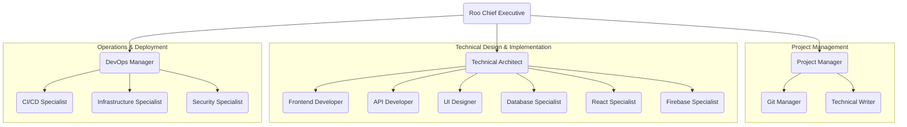

# 🤖 Roo Commander Modes Repository

This repository contains a collection of specialised AI assistant "modes" designed for use with the Roo Code VS Code extension. These modes enhance developer productivity by providing tailored support for various software development tasks directly within the IDE.

**Important:** This repository provides the *configuration files* for custom modes. It is **not** a VS Code extension to be installed directly. You need to have the Roo Code extension already installed in VS Code to use these modes.

## 🎯 Purpose

The primary goal of these modes is to streamline workflows by offering intelligent assistance for coding, debugging, documentation, architecture design, project management, and more. Each mode acts as a specialised expert, equipped with specific tools and instructions to effectively handle tasks within its domain.

## 🛠️ Mode Configurator Tool

This repository includes a web-based tool to help you select and generate the JSON configuration for the modes you want to use.

**How to Use:**

1.  **Ensure Node.js is installed.**
2.  **Navigate to the tool directory:** Open your terminal in the root of this repository and run `cd tools/mode_configurator`.
3.  **Install dependencies:** Run `npm install`.
4.  **Start the development server:** Run `npm run dev`. This will output a local URL (e.g., `http://localhost:5173/`).
5.  **Open the tool:** Open the provided URL in your web browser.
6.  **Select Modes:** Check the boxes next to the modes you wish to include in your custom configuration.
7.  **Copy JSON:** Use the "Copy to Clipboard" button to copy the generated JSON array from the text area.
8.  **Add to Roo Code:** Follow the steps in the next section ("Adding These Modes to Roo Code") to paste this copied JSON into your `cline_custom_modes.json`.

*(Alternatively, you can build the tool for static deployment (e.g., GitHub Pages) by running `npm run build` inside `tools/mode_configurator` and serving the contents of the resulting `dist` directory).*

## ⚙️ Adding These Modes to Roo Code

To use the modes defined in this repository (or generated by the configurator tool) with your Roo Code extension, follow these steps:

1.  **Copy Mode Configuration:**
    *   **Using the Configurator:** Copy the JSON generated by the tool (see previous section).
    *   **Using the Pre-combined File:** Open the `cline_custom_modes.json` file located in this repository. Select and copy its entire JSON content.
2.  **Open Roo Code Panel:** In VS Code, open the Roo Code panel (usually found in the sidebar).
3.  **Access Prompts View:** Click the 'Prompts' icon within the Roo Code panel (it looks like a book or page icon). This opens the Roo Code Mode Manager UI.
4.  **Edit Global Modes:** In the 'Prompts' view that appears, locate the 'Modes' section and click the 'Edit Global Modes' icon (it looks like curly braces `{}`).
5.  **Paste Configuration:** This action will open your personal `cline_custom_modes.json` configuration file in the VS Code editor. Paste the JSON content you copied in Step 1 into this file.
    *   If your file was empty, you can simply paste the content.
    *   If you already have existing custom modes defined, you will need to carefully merge the copied JSON array with your existing array, ensuring the final structure remains a valid JSON array of mode objects.
6.  **Save:** Save the changes to your `cline_custom_modes.json` file.
7.  **Verify:** The new modes from this repository should now appear in the mode selection dropdown within Roo Code.

## 🎨 Customisation Workflow

Once you have added the modes by pasting the content into your `cline_custom_modes.json` (as described above), you can further customise their behaviour.

*   **Modifying Modes (Recommended Method):** For ongoing customisation, such as tweaking instructions, changing roles, or adjusting mode parameters, use the **Roo Code Mode Manager UI** (accessed via the 'Prompts' icon). This interface provides a user-friendly way to manage your modes without directly editing the JSON file again after the initial setup.
*   **Custom Instruction Files (Reference Only):** This repository includes files like `custom_instructions_for_all_modes.md` and `custom_instructions_for_code_mode.md`. **These are provided as examples only** to show the *type* of custom instructions you *can* add via the Mode Manager UI. General users do **not** need to copy or use these specific `.md` files. They serve purely as a reference for the format and potential content of custom instructions.
*   **Direct JSON Editing (Advanced):** While possible, directly editing the individual mode `.json` files in the `modes/` directory or your global `cline_custom_modes.json` after the initial setup is generally **not recommended** for routine customisation. If you do choose to edit the JSON files directly (e.g., for creating entirely new modes or complex structural changes), ensure you maintain valid JSON format and understand the mode schema (refer to `ROO_MODE_SYSTEM.md`).

## 🧩 Included Custom Modes

This repository provides the following specialised modes (you can select which ones to use via the Mode Configurator tool):

*   **Accessibility Specialist:** Ensures applications are usable by people of all abilities. Reviews for compliance, implements features, and tests with assistive technologies.
*   **API Developer:** Designs and implements robust, secure, and performant APIs. Defines contracts, implements endpoints, and ensures system integration.
*   **Bug Fixer:** Identifies, diagnoses, and resolves software bugs. Investigates issues, reproduces problems, implements fixes, and creates regression tests.
*   **CI/CD Specialist:** Sets up and maintains continuous integration and deployment pipelines. Automates build, test, and deployment processes.
*   **Code Reviewer:** Reviews code for quality, adherence to standards, potential bugs, and security issues. Provides constructive feedback.
*   **Database Specialist:** Designs, implements, and optimizes database structures. Creates efficient data models and queries, ensuring data integrity.
*   **DevOps Manager:** Responsible for overall CI/CD, infrastructure, and operational concerns. Ensures smooth delivery pipelines and reliable workflows.
*   **Firebase Specialist:** Provides deep expertise in Firebase services (Auth, Firestore, Functions, etc.), offering implementation guidance and best practices.
*   **Frontend Developer:** Implements user interfaces and client-side functionality. Builds responsive components and handles frontend logic.
*   **Git Manager:** Manages source control operations (commits, branches, merges) and ensures repository health.
*   **Infrastructure Specialist:** Designs, implements, and manages cloud or on-premises infrastructure, ensuring reliability, scalability, and security.
*   **Integration Tester:** Tests interactions between different software components and systems to verify system behaviour.
*   **Material UI Specialist:** Provides expertise in the Material UI component library for React, focusing on implementation, customisation, and theming.
*   **MCP Server Creator (Python):** Generates boilerplate code for new Model Context Protocol (MCP) servers using the Python SDK.
*   **MCP Server Creator (TypeScript):** Generates boilerplate code for new Model Context Protocol (MCP) servers using the TypeScript SDK.
*   **Performance Optimizer:** Identifies and resolves performance bottlenecks in applications through profiling, analysis, and optimization.
*   **Project Manager:** Organizes, tracks, and coordinates software development projects. Breaks down objectives into tasks and assigns them.
*   **React Specialist:** Provides deep expertise in React.js, guiding implementation, state management, performance optimization, and best practices.
*   **Roo Chief Executive:** Highest-level coordinator for projects, overseeing the entire process and delegating to management roles.
*   **Security Specialist:** Ensures application and infrastructure security by identifying vulnerabilities, implementing controls, and performing reviews.
*   **Tailwind CSS Specialist:** Provides expertise in the Tailwind CSS utility framework, guiding implementation, customisation, and responsive design.
*   **Technical Architect:** Designs the overall system architecture, makes key technical decisions, and ensures technical coherence across the project.
*   **Technical Writer:** Creates clear, comprehensive documentation (user guides, API docs, technical specifications).
*   **UI Designer:** Creates user interfaces, designing mockups, wireframes, component styles, and user flows.

Explore the `tools/mode_configurator/public/mode_templates/` directory for the individual mode JSON files.

## 🔗 Mode Relationships

The following diagram illustrates the typical hierarchy and collaboration patterns between the different modes:

### Simplified Hierarchy

This diagram shows the primary delegation flow from management to specialist roles:

## 📜 License

This project is licensed under the MIT License. See the `LICENSE` file for details.

## 🤝 Contributing

Contributions are welcome! Please refer to CONTRIBUTING.md (to be created) for guidelines.

## 🔭 Future Plans

*   Expand the range of available modes.
*   Enhance tool capabilities within modes.
*   Refine mode instructions for better performance.
*   Add AI-driven mode generation capabilities to the Mode Configurator tool (requires backend infrastructure).