# Mode Manifest & Organizational Chart Concept

**Version:** 0.1
**Date:** 2025-04-13
**Status:** Proposed

## 1. Introduction

To enhance the usability and understanding of the Roo Commander multi-agent system, particularly for new users or complex projects, this document proposes the creation of a "Mode Manifest" or "Organizational Chart".

**Goal:** Provide a clear, accessible overview of the available modes (the "team"), their roles, capabilities, reporting structure (hierarchy), and key interaction patterns within the current project workspace.

## 2. Concept

The core idea is to generate or maintain a document (likely Markdown) that serves as a central directory for the active modes in the workspace. This document would be:

*   **Human-Readable:** Easily understood by the user.
*   **AI-Consumable:** Potentially used by `roo-commander` or `context-resolver` to understand available resources.
*   **Workspace-Specific:** Reflects the modes actually loaded or defined for the current project.

## 3. Potential Content & Structure

A potential structure for `mode-manifest.md` (or similar):

```markdown
# Roo Commander Team Manifest (Project: [Project Name])

**Generated:** YYYY-MM-DD HH:MM

## Team Structure (Hierarchy v7)

*   **00x-executive:** Overall Coordination
    *   `roo-commander`: 👑 Roo Commander
*   **01x-director:** Planning & Architecture
    *   `technical-architect`: 🏗️ Technical Architect
    *   `project-manager`: 📋 Project Manager
    *   `project-onboarding`: 🚀 Project Onboarding
*   **02x-lead:** Department Coordination
    *   **design:**
        *   `design-lead`: ��� Design Lead
    *   **frontend:**
        *   `frontend-lead`: ���️ Frontend Lead
    *   **backend:**
        *   `backend-lead`: ⚙️ Backend Lead
    *   **database:**
        *   `database-lead`: 💾 Database Lead
    *   **qa:**
        *   `qa-lead`: 🧪 QA Lead
    *   **devops:**
        *   `devops-lead`: 🚀 DevOps Lead
        *   `aws-architect`: ☁️ AWS Architect
        *   `azure-architect`: ☁️ Azure Architect
        *   `gcp-architect`: ☁️ GCP Architect
    *   **security:**
        *   `security-lead`: 🛡️ Security Lead
*   **03x-worker:** Task Execution
    *   **030-design:**
        *   `diagramer`: 📊 Diagramer
        *   `one-shot-web-designer`: ✨ One Shot Web Designer
        *   `ui-designer`: 🎨 UI Designer
    *   **031-frontend:**
        *   `react-specialist`: ⚛️ React Specialist
        *   `vuejs-developer`: 💚 VueJS Developer
        *   `tailwind-specialist`: 💨 Tailwind CSS Specialist
        *   ... (List all active frontend workers)
    *   **032-backend:**
        *   `api-developer`: ��� API Developer
        *   `fastapi-developer`: 🚀 FastAPI Developer
        *   ... (List all active backend workers)
    *   **033-database:**
        *   `database-specialist`: �� Database Specialist
        *   `mysql-specialist`: ��� MySQL Specialist
        *   ... (List all active database workers)
    *   **034-qa:**
        *   `e2e-tester`: 🧪 E2E Tester
        *   `integration-tester`: 🔗 Integration Tester
    *   **035-devops:**
        *   `cicd-specialist`: ��� CI/CD Specialist
        *   `infrastructure-specialist`: 🏗️ Infrastructure Specialist
        *   ... (List all active devops workers)
    *   **036-auth:**
        *   `supabase-auth-specialist`: 🔑 Supabase Auth Specialist
        *   `firebase-auth-specialist`: 🔥 Firebase Auth Specialist
        *   ... (List all active auth workers)
    *   **037-ai-ml:**
        *   `openai-specialist`: 🧠 OpenAI Specialist
        *   `huggingface-specialist`: 🤗 Hugging Face Specialist
        *   ... (List all active AI/ML workers)
    *   **039-cross-functional:**
        *   `git-manager`: ��� Git Manager
        *   `technical-writer`: ✍️ Technical Writer
        *   `security-specialist`: 🛡️ Security Specialist
        *   ... (List all active cross-functional workers)
*   **04x-assistant:** Support Functions
    *   `context-resolver`: 📖 Context Resolver
    *   `discovery-agent`: 🔍 Discovery Agent
    *   ... (List all active assistants)
*   **05x-footgun:** Expert Overrides (Use with Caution!)
    *   `footgun-code`: ��️ Footgun Code
    *   `footgun-architect`: 🏗️ Footgun Architect
    *   `footgun-debug`: �� Footgun Debug
    *   `footgun-ask`: 🗣️ Footgun Ask

## Mode Details (Summary)

*   **`roo-commander` (👑 Roo Commander):** [Brief Description from mode file]
*   **`technical-architect` (🏗️ Technical Architect):** [Brief Description from mode file]
*   ... (List all active modes with their emoji and brief description)

## Organizational Chart (Mermaid)

```mermaid
graph TD
    CMD(👑 Roo Commander) --> D_TA(🏗️ Dir: Tech Architect)
    CMD --> D_PM(📋 Dir: Project Manager)
    CMD --> D_PO(🚀 Dir: Project Onboarding)

    D_TA --> L_FE(���️ Lead: Frontend)
    D_TA --> L_BE(⚙️ Lead: Backend)
    D_TA --> L_DB(💾 Lead: Database)
    D_TA --> L_DO(🚀 Lead: DevOps)
    D_TA --> L_SEC(🛡️ Lead: Security)
    D_PM --> L_FE
    D_PM --> L_BE
    D_PM --> L_DB
    D_PM --> L_DO
    D_PM --> L_QA(🧪 Lead: QA)
    D_PM --> L_DES(🎨 Lead: Design)
    D_PM --> L_SEC

    L_FE --> W_FE_React(⚛️ Worker: React)
    L_FE --> W_FE_Vue(💚 Worker: Vue)
    L_FE --> W_FE_Gen(🖥️ Worker: Frontend Gen.)
    L_BE --> W_BE_API(🔌 Worker: API Dev)
    L_BE --> W_BE_FastAPI(🚀 Worker: FastAPI)
    L_DB --> W_DB_Gen(💾 Worker: DB Gen.)
    L_DB --> W_DB_MySQL(🐬 Worker: MySQL)
    L_DO --> W_DO_CICD(🔄 Worker: CI/CD)
    L_DO --> W_DO_Infra(🏗️ Worker: Infra)
    L_DO --> A_AWS(☁️ Lead: AWS Arch)
    L_DO --> A_AZURE(☁️ Lead: Azure Arch)
    L_DO --> A_GCP(☁️ Lead: GCP Arch)
    L_QA --> W_QA_E2E(🧪 Worker: E2E)
    L_QA --> W_QA_Int(🔗 Worker: Integration)
    L_DES --> W_DES_UI(🎨 Worker: UI Design)
    L_DES --> W_DES_Diag(📊 Worker: Diagramer)
    L_SEC --> W_XF_SEC(🛡️ Worker: Security)

    subgraph Cross-Functional Workers
        W_XF_Git(🔧 Git Manager)
        W_XF_TW(✍️ Tech Writer)
        W_XF_SEC
        W_XF_Refactor(✨ Refactor Spec.)
        W_XF_Bug(��� Bug Fixer)
    end

    subgraph Assistants
        ASST_CR(📖 Context Resolver)
        ASST_DA(🔍 Discovery Agent)
    end

    subgraph Footgun Modes
        FG_Code(⚡️ Footgun Code)
        FG_Arch(🏗️ Footgun Architect)
        FG_Debug(🔬 Footgun Debug)
        FG_Ask(🗣️ Footgun Ask)
    end

    CMD --> W_XF_Git
    CMD --> W_XF_TW
    CMD --> ASST_CR
    CMD --> ASST_DA
    CMD --> FG_Code
    CMD --> FG_Arch
    CMD --> FG_Debug
    CMD --> FG_Ask

    %% Add more connections as needed based on typical workflows / escalations
```



## 4. Implementation Considerations

*   **Location:** Could reside in `project_journal/planning/mode-manifest.md` (more visible) or `.roo/docs/mode-manifest.md` (more centralized with config). Decision needed.
*   **Generation:** Could be manually maintained, partially generated by a script analyzing loaded modes, or fully generated by a dedicated tool/mode. Manual maintenance is simplest initially but prone to staleness.
*   **Updating:** Needs a process for updating when modes are added/removed/modified.
*   **AI Consumption:** If intended for AI use (e.g., Commander referencing it), the structure needs to be predictable and easily parsable.

## 5. Benefits

*   Improves user understanding of the system's capabilities and structure.
*   Provides a quick reference for available modes and their roles.
*   Can potentially aid AI modes (like Commander) in selecting appropriate delegates.
*   Formalizes the "team" concept.

## 6. Next Steps

*   Decide on the final location and filename.
*   Determine the generation/maintenance strategy.
*   Create an initial version based on the current v7.0 mode set.
*   Consider integrating references to this manifest into the `roo-commander`'s initial greeting or help responses.