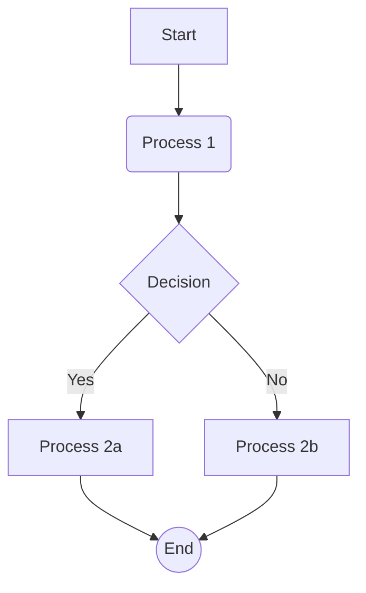
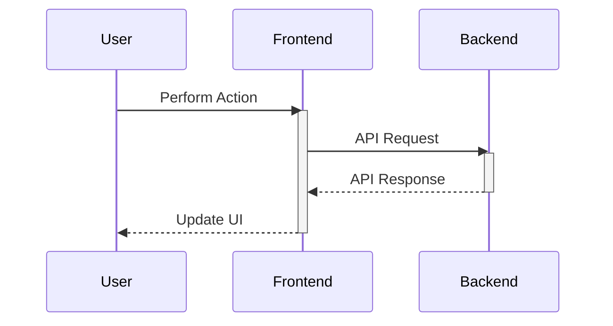
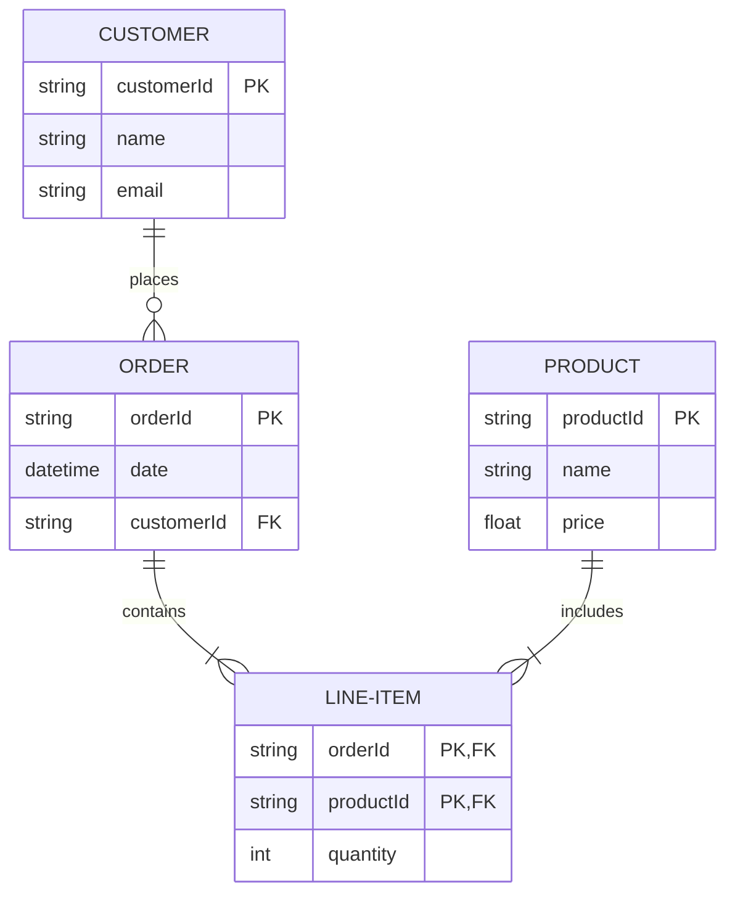
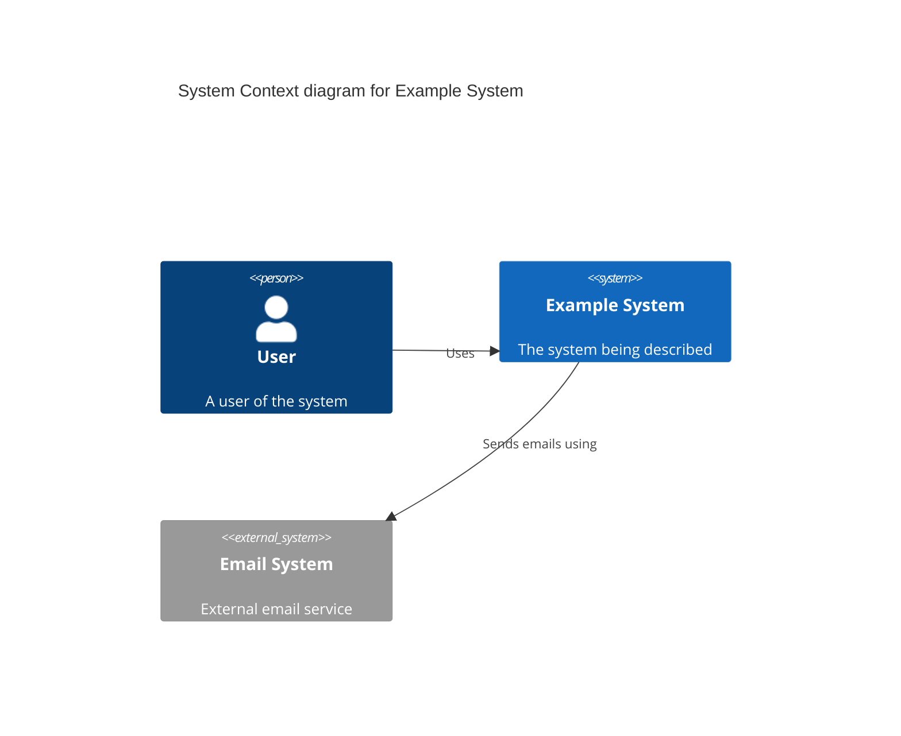
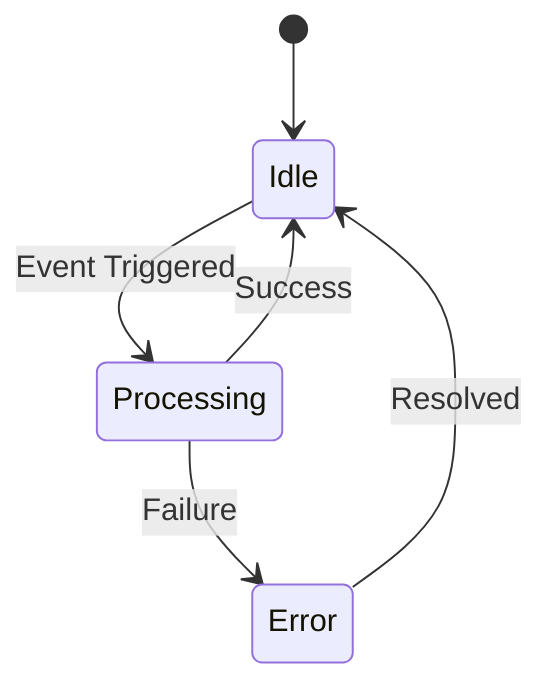

# Mermaid Diagram Templates

Common starting points for various diagram types.

## Flowchart / Graph



## Sequence Diagram



## Entity Relationship Diagram (ERD)



## C4 Context Diagram



## State Diagram



## Gantt Chart

```mermaid
gantt
    dateFormat  YYYY-MM-DD
    title Project Timeline Example
    section Phase 1
    Task 1           :a1, 2025-04-15, 7d
    Task 2           :after a1  , 5d
    section Phase 2
    Milestone        :milestone, m1, 2025-05-01
    Task 3           :after m1  , 10d
```

*(Use these as starting points and adapt based on specific requirements.)*