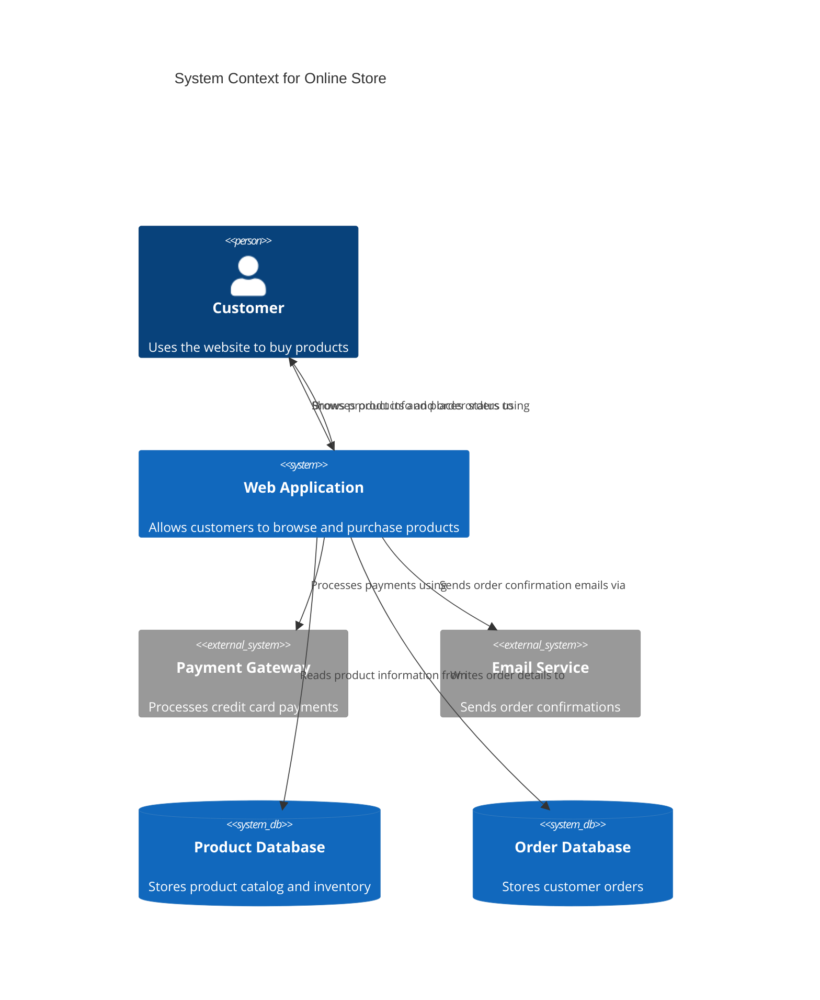
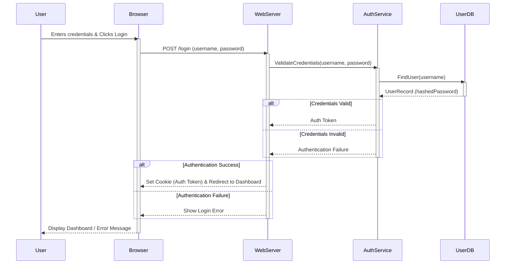

# Example Diagrams

This file contains examples of well-structured Mermaid diagrams relevant to this project, illustrating the use of the `diagram-style-guide.md`.

## Example 1: High-Level System Architecture (C4 Context)

## Example 2: User Login Sequence

*(Add more relevant examples for different diagram types used in the project.)*